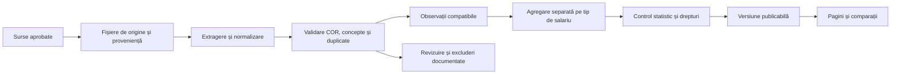

# Arhitectura bazei salariale

Propunere de implementare. Nu este o migrare aplicată producției.

## 1. Entități și separarea responsabilităților



Pentru început este suficientă o bază relațională și un spațiu de stocare pentru dovezi; nu este necesar un ansamblu mare de servicii. Procesarea se execută în joburi cu versiuni. Site-ul citește numai pachete publicabile, niciodată direct fișierele brute sau un API comercial la fiecare vizită.

## 2. Dicționarul de date

| Entitate | Câmpuri | Reguli |
|---|---|---|
| `occupation` | `cor6`, `official_name`, `taxonomy_version`, `valid_from`, `valid_to`, `legal_source`, `isco4` verificat | Cod text de șase caractere, inclusiv zero inițial. Versiunile vechi nu se suprascriu. |
| `role` | `role_id`, `slug`, `display_name`, `description`, `specialisation` | Obiect editorial separat de COR; o ocupație poate avea sinonime, iar un rol poate acoperi mai multe ocupații. |
| `occupation_mapping` | `source_taxonomy`, `source_role_id`, `cor6`, `relation`, `confidence`, `evidence`, `reviewer`, `reviewed_at`, `valid_from/to` | `exact/broader/narrower/related/ambiguous`; numai maparea adecvată populației intră în agregat. Nu primește un COR din prefix. |
| `source` | `source_id`, `owner`, `source_family`, `origin_dataset`, `access_method`, `reference_url`, `update_cadence` | `origin_dataset` identifică reambalarea aceleiași anchete. |
| `source_rights` | `contract_id`, `licence`, `allow_store`, `allow_derive`, `allow_public_aggregates`, `allow_public_microdata`, `allow_model_training`, `attribution`, `retention`, `expires_at`, `min_cell_rule` | Necunoscut nu este permis. Întreruperea licenței blochează regenerarea și declanșează regulile contractuale pentru datele existente. |
| `evidence` | `source_id`, `source_url`, `fetched_at`, `reference_start/end`, `content_hash`, `file_pointer`, `sheet/page/row`, `parser_version` | Dovezi minime necesare, cu acces restrâns. Capturarea nu acordă drept de republicare. |
| `salary_observation` | `observation_id`, `source_record_id`, `source_id`, `origin_dataset`, `sample_unit`, `person_or_contract_token`, `employer_token`, `reference_start/end`, `occupation_mapping_id`, `kind` | Identificatori pseudonimi doar când există temei; preferăm preagregare la partener. Nu stocăm nume/CNP. |
| Remunerație în observație | `salary_concept`, `amount`, `lower`, `upper`, `bound_type`, `gross_net`, `currency`, `periodicity`, `components`, `original_text` minim | `amount` pentru punct; `lower/upper` pentru interval. Nu completăm mijlocul în `amount`. |
| Muncă și geografie | `hours_per_week`, `full_month`, `employment_type`, `work_country`, `work_county`, `work_city`, `geo_version`, `remote_eligibility`, `pay_zone` | CIM, B2B și independenți separat; țara eligibilă nu este grila de plată. |
| Experiență | `role_experience_years`, `career_experience_years`, `employer_tenure_years`, `provider_level`, `normalised_level`, `level_mapping_version` | Vârsta nu completează experiența. Lipsa rămâne `null`. |
| Calitate | `is_imputed`, `imputation_method`, `weight`, `weight_source`, `dedup_cluster`, `validation_flags`, `exclusion_reason`, `review_status` | Outlier-ul nu este șters fără motiv; valorile originale se păstrează conform drepturilor. |
| `provider_statistic` | cohortă, `mean`, `median`, `p25`, `p75`, `n_definition`, `n`, `n_employers`, `method`, `model`, `quality`, sursă și perioadă | Nu este descompus artificial în observații. `n` nul este diferit de zero. |
| `aggregate` | `cor/role`, cohortă, concept, perioadă, `mean/median/p25/p75`, `n_raw/n_valid/n_unique/n_employers/n_eff/N_population`, CI-uri, ponderi, surse, excluderi | Separație între distribuția eșantionului și estimarea națională. |
| `publication` | `aggregate_version`, `decision`, `scope_label`, `quality_review`, `rights_review`, `published_at`, `next_review`, `revision_note`, `citation` | Nu se publică direct rezultatul agregării. Retragere și rollback posibile, cu istoric. |

## 3. Tipurile de date nu se amestecă

Valori permise pentru `kind`:

- `paid_employee`: plată observată din salarizare, cu perioadă și concept;
- `contract_base`: baza contractuală;
- `self_reported_employee`: declarație pe o platformă externă;
- `advertised_point` / `advertised_interval`: ofertă de angajare;
- `public_grid`: drept/grilă publicată;
- `official_aggregate`: statistică oficială, cu design și imputări documentate;
- `provider_aggregate`: statistică a furnizorului, fără microdate;
- `modelled`: rezultat modelat.

Aceeași meserie poate avea mai multe panouri pe pagină. Nu trebuie să aibă un singur număr obținut din toate aceste tipuri.

## 4. Contractul unei statistici publicabile

```json
{
  "cor6": null,
  "role_id": null,
  "taxonomy_version": null,
  "kind": null,
  "salary_concept": null,
  "gross_net": null,
  "currency": "RON",
  "periodicity": "month",
  "reference_start": null,
  "reference_end": null,
  "geography": null,
  "experience_definition": null,
  "mean": null,
  "median": null,
  "p25": null,
  "p75": null,
  "n_unique": null,
  "n_definition": null,
  "n_employers": null,
  "n_eff": null,
  "population_estimate": null,
  "median_ci95": null,
  "estimation_method": null,
  "evidence_ids": [],
  "publication_status": "not_evaluated"
}
```

Acesta este un șablon gol, nu un salariu. Nicio celulă numerică nu se umple din presupunere. `publication_status` poate fi `not_evaluated`, `quarantined`, `reference_only`, `sample_statistics`, `population_estimate` sau `suppressed`.

## 5. Importul

1. Verificarea contractului și a expirării sale, înainte de cererea de date.
2. Descărcare incrementală cu limită de rată, timeout și număr limitat de reîncercări; fără evitarea autentificării sau a blocajelor furnizorului.
3. Validarea formatului, antetelor, unităților, perioadelor și numărului de rânduri. Schimbarea formatului oprește publicarea.
4. Parsare cu dovezi la nivel de câmp. OCR și extragerile automate sensibile la coloane se verifică pe eșantion.
5. Normalizare, mapare ocupațională și deduplicare, cu păstrarea ambiguităților.
6. Generarea cohortelor comparabile. Regiune și experiență se intersectează numai dacă observațiile au ambele informații.
7. Calcul statistic, controale de confidențialitate și evaluarea preciziei.
8. Revizuire, atribuirea surselor, versionare și export pentru site.

Pentru anunțuri expirate păstrăm, când contractul permite, faptul că oferta a existat la acea dată; eliminăm eticheta „job disponibil”. Pentru salarii și grile păstrăm perioada de aplicabilitate. `fetched_at` nu înlocuiește `reference_end`.

## 6. Pagini și date structurate

Site-ul ar trebui să consume un singur serviciu/pachet `publication`, reutilizat în paginile de meserie, comparații, FAQ, descrieri și huburi. Astfel evităm ca cifra principală să fie corectată, dar aceeași sumă veche să rămână în metadata sau comparații.

Nu publicăm în JSON-LD salarii mai precise decât cele afișate. Nu adăugăm `JobPosting` unui articol despre salarii. Dacă un set de date este publicat ca atare, descrierea sa trebuie să indice licența, variabilele, perioada, proveniența și versiunea; un tip schema.org nu garantează eligibilitate pentru un rezultat special Google.

## 7. Problemele de înlocuit în codul existent

În `src/lib/observatii-salariale.ts`, logica existentă permite potrivirea după primele patru cifre și agregă mijloacele unor intervale. Pentru noul sistem, acestea trebuie înlocuite cu mapări validate și tipuri separate de observație. Un prag de cinci rânduri nu dovedește cinci persoane independente și nici reprezentativitate.

În `src/lib/meserii.ts` trebuie revizuite codurile și separată ocupația oficială de rolul editorial. Consumatorii paginilor și comparațiilor trebuie mutați împreună pe date publicabile. Înaintea migrării, se inventariază toate utilizările valorilor existente; nu facem înlocuiri parțiale care creează afirmații contradictorii.

Studiul a adăugat instrumente în directorul `research/`; nu a activat aceste schimbări în site. Nu există în prezent un lot licențiat cu salarii plătite pe toate ocupațiile care să justifice o astfel de migrare în masă.
